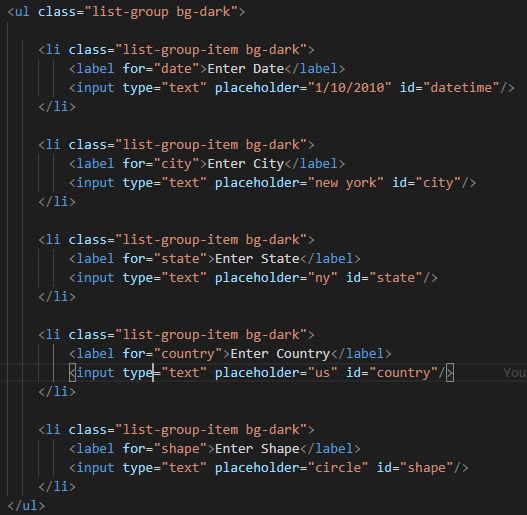
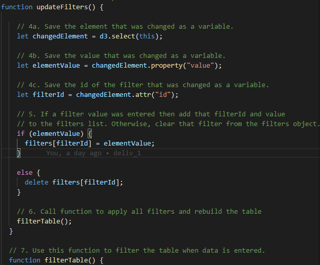
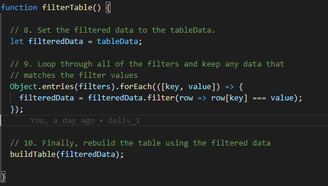
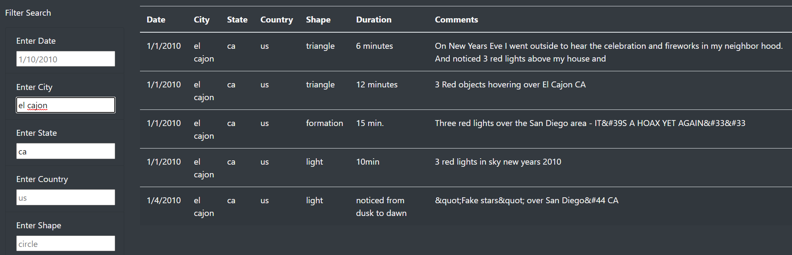

# UFOs
Module 11

## Overview of the project:
The purpose of this project was to help Dana build a dynamic webpage where users can filter the data table. In addition to the `date`, we added more filters for the `city`, `state`, `country` and `shape`.

## Results:
•	First, we removed the filter `button` from the `index.html` file and added four new items to the unordered list `<ul/>`.

•	Next, in the JavaScript app, we created an empty variable `var filters = {};` to hold the changed element in the placeholders.

•	We then inserted an event listener using `d3` to check for changes in the input placeholder just before the `buildTable(tableData);` function.
    ` d3.selectAll("input").on("change", updateFilters); `

•	We modified the `updateFilters()` function, by first creating a variable for the changed element using `d3.select(this)`, then saving the values of those elements into a new variable. We also saved the id of the modified filters to a variable and used an if-else statement to use or not each filters.

•	Lastly, we rebuilt the filtered table with a loop that check for matching key: values. 

In the new webpage, a user can enter between one and five search criteria, and the table will be return with the filtered results as the example below.

## Summary:
•	In summary, this new table is working properly but to clear the filters, we must either delete all entry and press `ENTER` or go back up to the top of the page to refresh the page by clicking on UFO sightings. 

•	To improve this page, we could add a `CLEAR` or `RESET` button to remove the filters.

•	Also, I did not like the filters label and placeholder on the same line as it made everything not aligned, so I reduced the size from `col-md-3` to `col-md-2` for the filter container. The same works for large screen with code `col-xl-2`, but it does not work for mobile device. The code `col-xs-2` or `col-sm-2` did not squeezed the filters to force the placeholder below the label. We would need to work on other alignment methods to make the page modile friendly. This might be what was done in the module challenge since the final picture of the table shows placeholders below the label despite instructing us to use `col-md-3`.
